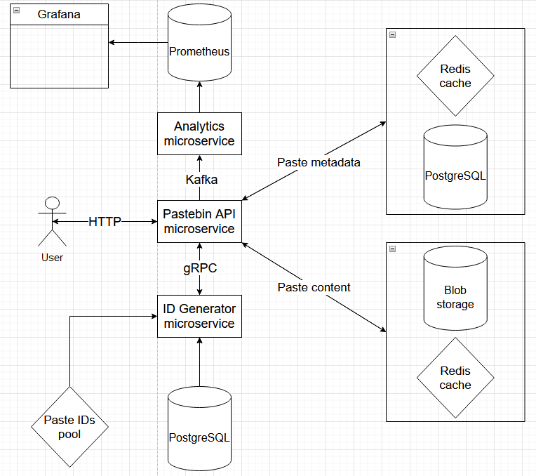

# Адаптированный к высокой нагрузке [Pastebin](https://pastebin.com) на микросервисах 
### Описание
Приложение представляет собой адаптированную к высокой нагрузке реализацию
сервиса [Pastebin](https://pastebin.com). Сервис позволяет сохранять текст
и удобно передавать его другим по ссылке.

# Нагрузочное тестирование на моем компьютере
Приложение способно выдерживать нагрузку 447 запросов в секунду, из которых
примерно каждый десятый запрос - публикация текста, оставшиеся - чтение, 
что предположительно соответсвует типичному сценарию использования. 
Среднее время ответа 0.035 секунды.



### Приложение разделено на три микросервиса:
* Pastebin API - микросервис создания и получения текста
* ID generator - микросервис генерации уникальных ID для текста
* Analytics - микросервис аналитики

### Стек технологий:
* Spring Boot
* PostgreSQL
* Redis
* MinIO (BLOB storage)
* Apache Kafka
* gRPC
* Prometheus
* Grafana
* Docker

### Запуск приложения:
```
docker compose up
```
* По ссылке http://localhost:8080/swagger-ui/index.html можно опробовать 
приложение через Swagger UI.

* Доступ к аналитике: http://localhost:3000 -> логин и пароль admin -> 
справа вкладка Dashboards -> выбрать dashboard из списка
